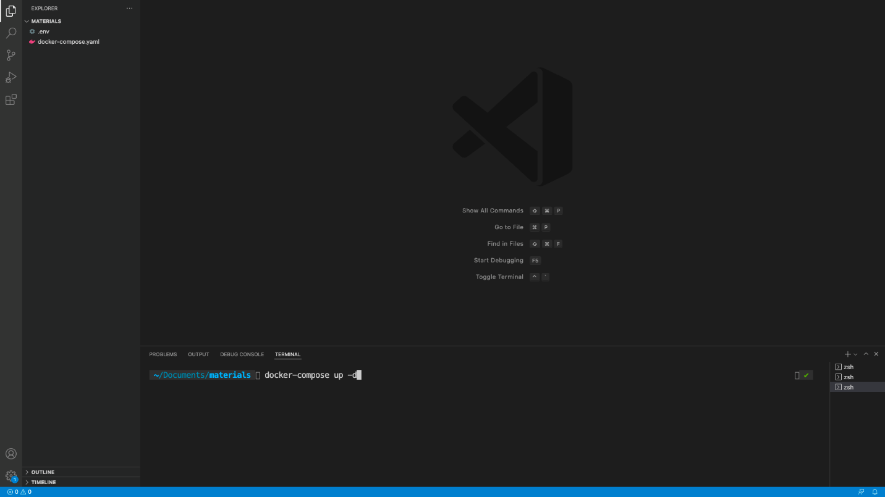

**\[Practice\] Installing Apache Airflow**

Installing Apache Airflow

Hi there 👋

It\'s time to install Apache Airflow. As you are going to see, it\'s
very simple.

**Prerequisites**

First, make sure you have installed Docker Desktop and Visual Studio. If
not, take a look at these links:

-   [[Get Docker]{.underline}](https://docs.docker.com/get-docker/)

-   [[Get Visual Studio
    Code]{.underline}](https://code.visualstudio.com/download)

Docker needs privilege rights to work, make sure you have them.

**Follow the documentation first.**\
If you have trouble to install these tools, here are some videos to help
you

-   [[Install Docker on Windows
    10]{.underline}](https://www.youtube.com/watch?v=lIkxbE_We1I&ab_channel=JamesStormes)

-   [[Install Docker on Windows 10 with WSL
    2]{.underline}](https://www.youtube.com/watch?v=h0Lwtcje-Jo&ab_channel=BeachcastsProgrammingVideos)

-   [[Install Docker on Windows
    11]{.underline}](https://youtu.be/6k1CyA5zYgg?t=249)

**Install Apache Airflow with Docker**

1.  Create a folder **materials **in your **Documents**

2.  In this folder, download the following file: [[docker compose
    file]{.underline}](https://airflow.apache.org/docs/apache-airflow/2.5.1/docker-compose.yaml)

3.  If you right-click on the file and save it, you will end up with
    docker-compose.yaml.txt. Remove the .txt and keep
    docker-compose.yaml

4.  Open your terminal or CMD and go into **Documents/materials**

5.  Open Visual Studio Code by typing the command: code .

6.  You should have something like this

> {width="6.5in" height="3.65625in"}

7.  Right click below docker-compose.yml and create a new
    file .env (don\'t forget the dot before env)

8.  In this file add the following lines

    a.  AIRFLOW_IMAGE_NAME=apache/airflow:2.4.2

    ```{=html}
    <!-- -->
    ```
    a.  AIRFLOW_UID=50000

> and save the file
>
> {width="6.5in" height="3.65625in"}

9.  Go at the top bar of Visual Studio Code -\> Terminal -\> New
    Terminal

> {width="6.5in" height="3.65625in"}

10. In your new terminal at the bottom of Visual Studio Code, type the
    command docker-compose up -d and hit ENTER

> {width="6.5in" height="3.65625in"}

11. You will see many lines scrolled, wait until it\'s done. Docker is
    downloading Airflow to run it. It can take up to 5 mins depending on
    your connection. If Docker raises an error saying it can\'t download
    the docker image, ensure you are not behind a proxy/vpn or corporate
    network. You may need to use your personal connection to make it
    work. At the end, you should end up with something like this:

> {width="6.5in" height="3.65625in"}

Well done, you\'ve just installed Apache Airflow with Docker! 🎉

Open your web browser and go to localhost:8080

{width="6.5in" height="3.65625in"}

Troubleshoots

-\> If you don\'t see this page, make sure you have nothing already
running on the port 8080

Also, go back to your terminal on Visual Studio Code and check your
application with docker-compose ps

All of your \"containers\" should be healthy as follow:

{width="6.5in"
height="1.4986111111111111in"}

If a container is not healthy. You can check the logs with docker logs
materials_name_of_the_container

Try to spot the error; once you fix it, restart Airflow
with docker-compose down then docker-compose up -d

and wait until your container states move from starting to healthy.

-\> If you see this error

{width="6.5in"
height="0.3798611111111111in"}

remove your volumes with docker volume prune and run docker-compose up
-d again

-\> If you see that airflow-init docker container has exited, that\'s
normal :)

If you still have trouble, reach me on the Q/A with your error.
